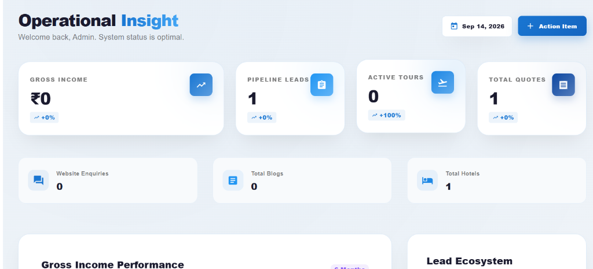
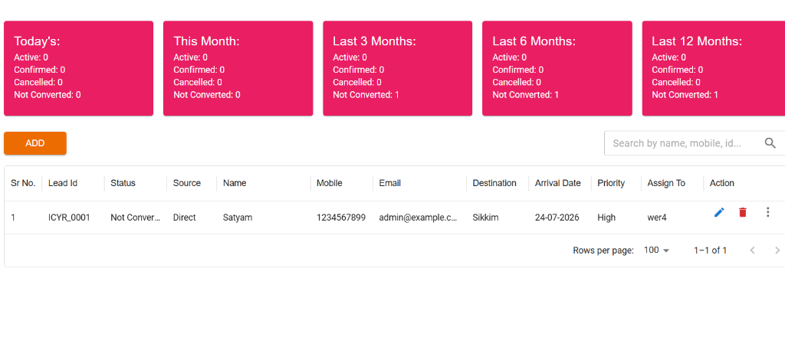
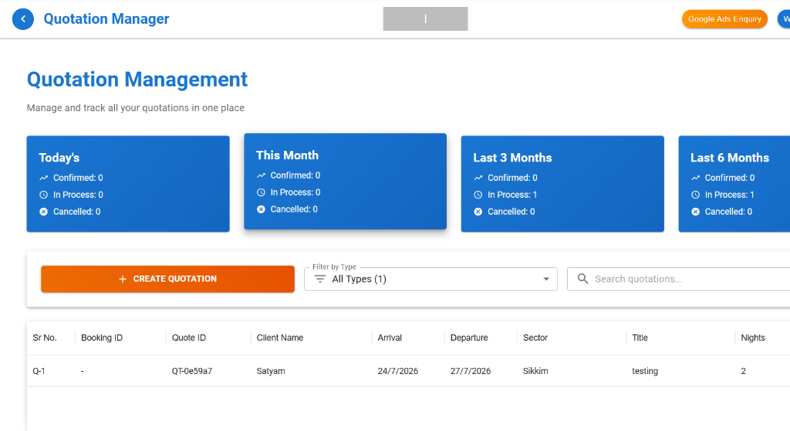
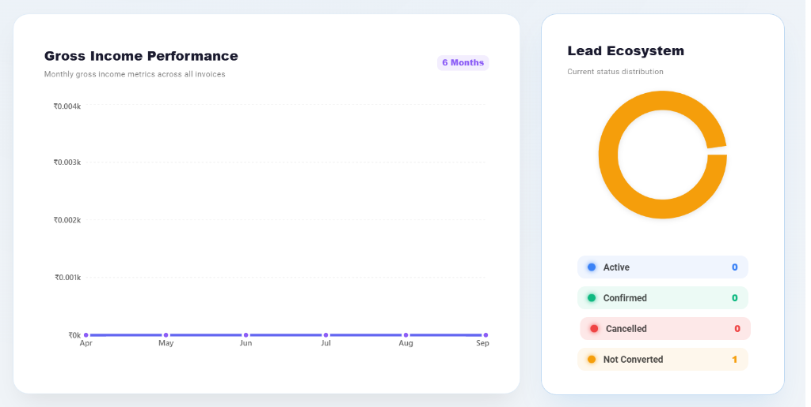
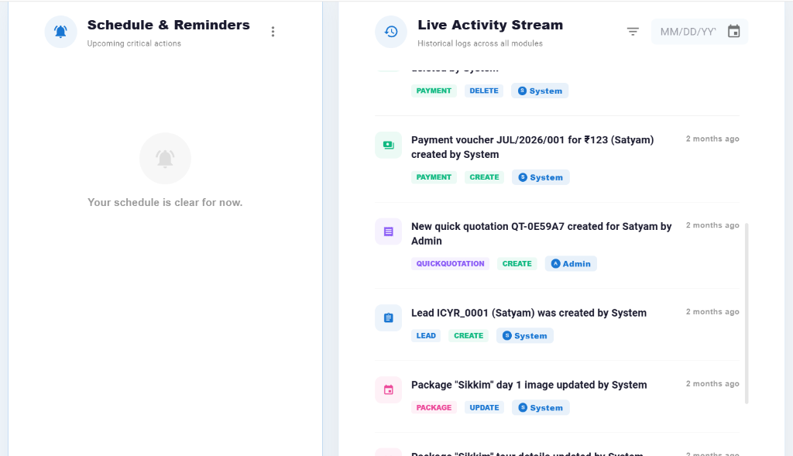

# Transform Your Travel Business with Iconic Yatra CRM
**Iconic Yatra Mobile Number: 7053900957**

---

## 1. Welcome to the Future of Travel Management
Are you tired of juggling multiple spreadsheets, losing track of customer leads, and spending hours creating travel quotations? 

The **Iconic Yatra CRM** is the ultimate all-in-one software designed specifically for modern travel agencies. We built this platform to help you automate your daily tasks, impress your customers, and ultimately—**grow your sales and revenue**.

Right from the moment you log in, your **Operational Insight** dashboard gives you a bird's-eye view of your entire business. Instantly track your Gross Income, Pipeline Leads, Active Tours, and Website Enquiries on one single screen, ensuring you are always in complete control.

## 2. Never Miss a Sale: The Lead Ecosystem
Stop letting potential customers slip through the cracks. Our comprehensive lead management system tracks every prospect from initial inquiry to final booking.
* **Lead Ecosystem & Categorization:** Our visual dashboard instantly breaks down your leads into clear statuses: *Active, Confirmed, Cancelled,* or *Not Converted*, so you know exactly where your business stands.
* **Smart Filtering:** Effortlessly filter your lead performance by *Today, This Month, Last 3 Months,* or the entire year to track your growth over time.
* **Detailed Lead Tracking:** Capture and organize crucial data including the Lead Source, Destination (Sector), Arrival Date, and Priority level (High/Medium/Low). 
* **Staff Assignment:** Directly assign leads to specific team members from the dashboard so everyone knows exactly who they need to follow up with.

## 3. The 60-Second Quotation Manager
Creating beautiful, accurate travel quotes used to take hours. With the **Quotation Manager**, it takes seconds.
* **Track All Quotes:** Manage and track all your quotations in one place. Instantly see how many quotes are *In Process, Confirmed,* or *Cancelled* this month.
* **All-in-One Generation:** Generate complete travel proposals with just a click of the "Create Quotation" button.
* **Instant Details:** Quickly view Quote IDs, Client Names, Travel Sectors, Arrival/Departure dates, and total Nights at a single glance without having to open multiple files.

---

## 4. Effortless Itinerary & Package Builder
Showcase your travel packages like never before without starting from scratch.
* **AI-Powered Visuals & Itineraries:** Automatically generate smart itineraries and breathtaking destination photos using built-in AI, saving your staff hours of manual searching.
* **One-Click Package Cloning:** Have a successful itinerary already? Simply copy the entire package with one click and tweak the details, rather than building destinations and plans from scratch.
* **Day-by-Day Planning:** Create detailed, day-wise travel plans with assigned hotels and vehicles effortlessly.
* **Flexible Pricing:** Instantly adjust base prices, manage seasonal availability, and update your offerings without any technical headaches.

## 5. Get Paid Faster & Track Gross Income
Take the stress out of your accounting and cash flow with beautiful, easy-to-read analytics.
* **Gross Income Performance:** Our visual 6-month performance graphs let you easily track your monthly gross income metrics across all invoices. 
* **Instant Online Payments:** Our system comes fully integrated with trusted payment gateways, allowing your customers to pay securely online.
* **Automated Invoicing:** The moment a booking is confirmed, the CRM automatically generates professional, branded invoices and payment receipts.

## 6. Empower Your Team: Live Activity & Reminders
As your business grows, our CRM ensures nothing falls through the cracks and your team stays accountable.
* **Schedule & Reminders:** Never miss a client follow-up. The upcoming critical actions panel keeps your team on track every day.
* **Live Activity Stream:** Complete transparency for the business owner. The historical log tracks every action across all modules—whether the System generated a payment voucher, or an Admin updated a package image, you will see exactly who did what, and when.
* **Staff Control:** Give your team members individual logins. You decide exactly what they can see and do, keeping your sensitive business data completely secure.

---

## 7. Control Your Website and Brand Identity
You don't need an IT guy to manage your website anymore.
* **Dynamic, Infinite Blogging Engine:** Dynamically create, publish, and manage an unlimited number of SEO-optimized travel blogs directly from your CRM. 
* **Live Website Updates:** Update your website's hero banners, promotional landing pages, and special offers in real-time straight from your dashboard.
* **100% Your Brand:** The system is fully white-labeled to your brand—your logo, your brand colors, and your unique business identity.

## 8. Why Choose Iconic Yatra CRM?
* **Save Time:** Automate your manual work and free up your team to focus on selling.
* **Look Professional:** Deliver stunning quotes, invoices, and emails that build trust with your clients.
* **Increase Bookings:** Faster response times and better lead management directly lead to higher revenue.
* **Zero Technical Knowledge Required:** If you can use a smartphone, you can master our CRM.

**Ready to take your travel business to the next level?**
Upgrade to the Iconic Yatra CRM today and give your business the ultimate advantage in a competitive market.

**Contact Us Today to Get Started!**
📞 **7053900957**
